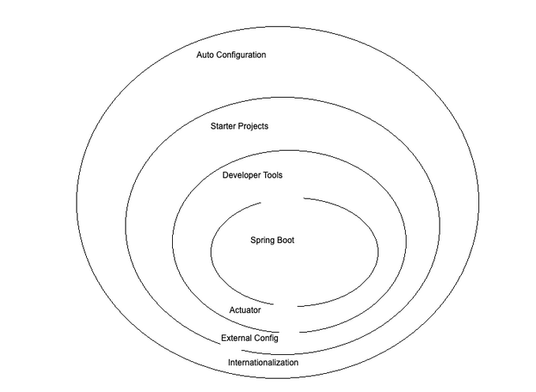
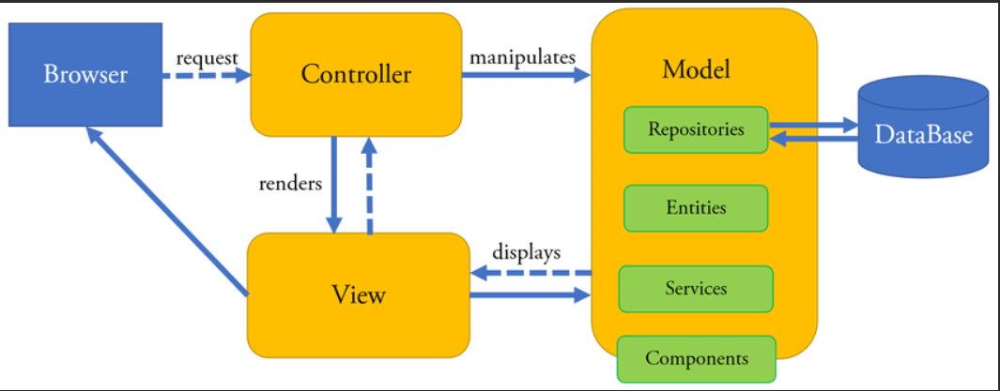
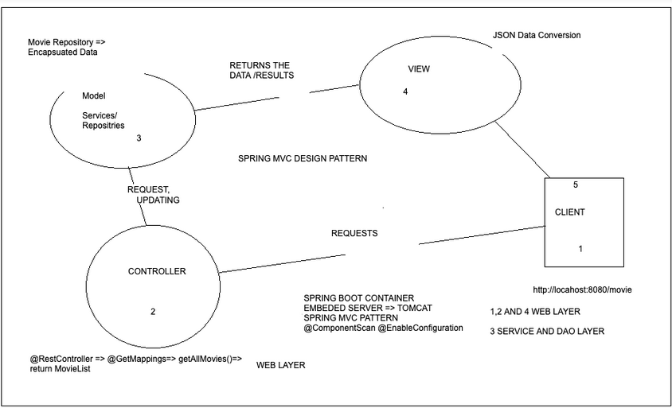

Between Two Applications => API => XML/JSON

Client => Browser 

Tomcat server => Application => Java

_REST Service_ :
Client -> HTTP -> Request -> REST Interface -> Application Logic -> JSON Converted JSON -> Response -> Tomcat Server -> HTTP

<h1> **_SPRING BOOT CONTAINER_** </h1>

**Dependencies**

1. Starter-json => converting array to JSON response
2. Apache tomcat => Autoconfiguration with localhost:8080
3. Spring-boot-autoconfigure

@SpringBootApplication
    => SpringBootRestAPI => Class
        => @ComponentScan
            => @RestController
                => RecommendationController => Class => return an array back => Converted into a JSON response => starter-json

            -> Tomcat Server is autoconfigured => Servelet Container Configurations Default

**_Application Layering_**

WEB LAYER

=> @SpringBootApplication
=> @ComponentScan, @Configuration

=> @RestController 
    => @GetMapping
        => getAllMovies()
            => return ArrayList
                => toJson()

=> Client => Tomcat Server => localhost:8080

SERVICE LAYER

DAO LAYER

DATABASE

DEVELOPER TOOLS

STARTER PROJECTS
=> SPRING WEB

ACTUATOR

SPRING FRAMEWORK

1. Spring MVC
2. Spring Boot

